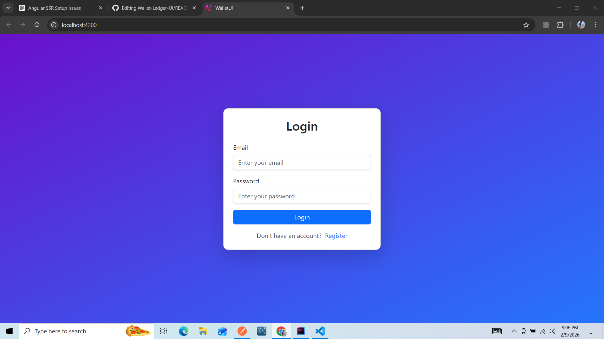
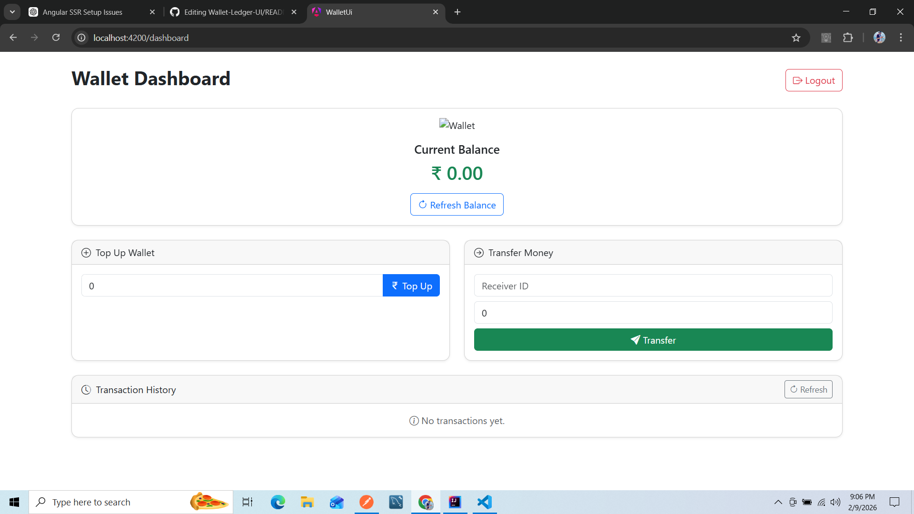
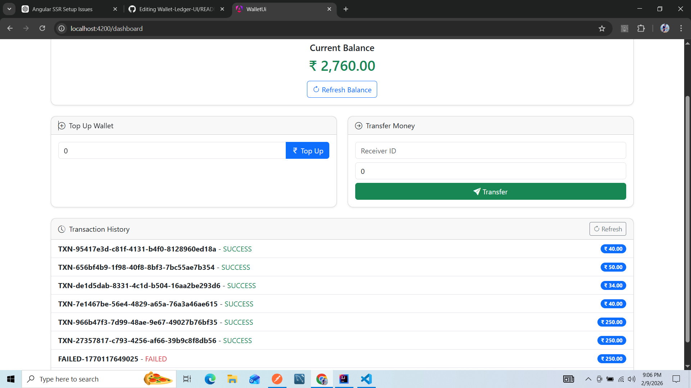
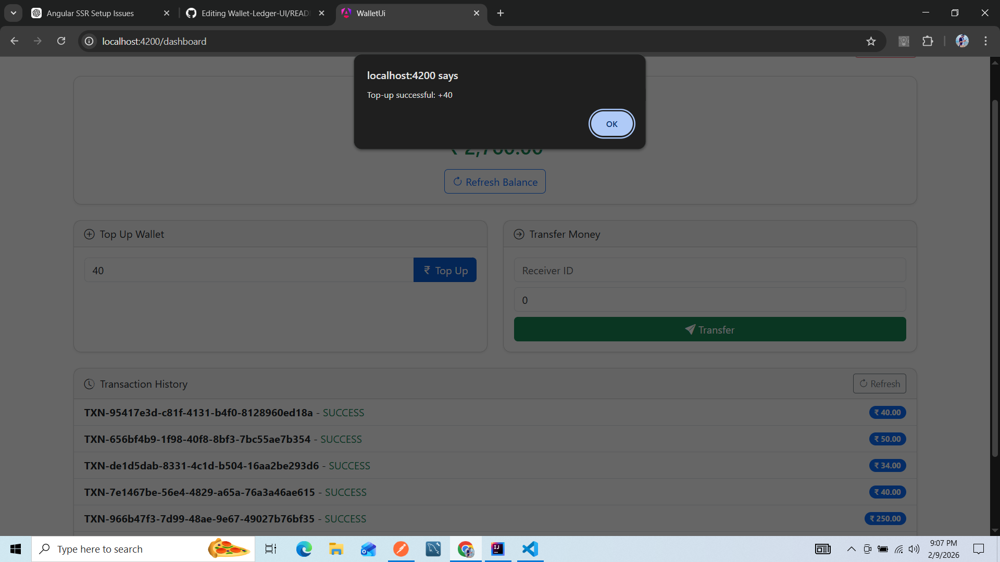
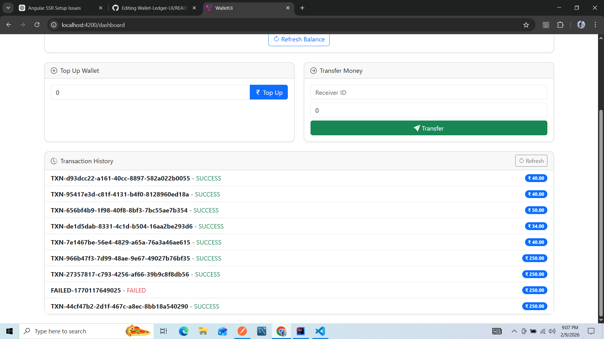

# Wallet Ledger UI

A modern Angular-based Wallet Management Dashboard that allows users to login, register, top-up, transfer, and track wallet transactions with a clean, responsive, and user-friendly interface.

## 📸 Demo Screenshots

### 🔐 Login

### 📊 Dashboard

### 💰 Balance

### ➕ Top Up

### 🔁 Transfer

### 📜 Transactions

# Features

User Authentication: Login and register users with JWT-based authentication.

Wallet Dashboard: Display current balance, top-up wallet, and transfer money.

Transaction History: Track all wallet transactions with status (PENDING, SUCCESS, FAILED).

Access Control: Guards to prevent unauthorized access to dashboard pages.

Responsive Design: Works across desktop, tablet, and mobile devices.

Modern UI: Built with Bootstrap for a clean, intuitive design.

# Tech Stack

Frontend: Angular 21, TypeScript, HTML, CSS

UI Framework: Bootstrap 5, Bootstrap Icons

State Management: Angular Signals

HTTP & API: Angular HttpClient, JWT Interceptor

Routing & Guards: Angular Router, Auth Guards

# Setup & Installation
Prerequisites

Node.js >= 20

Angular CLI >= 21

Installation Steps
# Clone repository
git clone https://github.com/2023ayush/Wallet-Ledger-UI.git
cd Wallet-Ledger-UI

# Install dependencies
npm install

# Start development server
ng serve

Open your browser at http://localhost:4200
. The app will reload automatically on code changes.

# Usage

Login Page: Users can log in with email and password.

Register Page: New users can create an account.

Dashboard: Once logged in, users can:

View wallet balance

Top-up wallet

Transfer money to another wallet

View transaction history

Attempting to access dashboard without login will redirect to login page.
